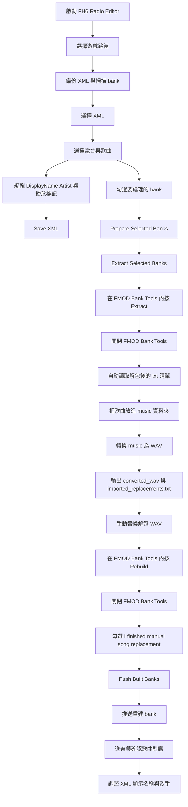

# FH6 Radio Editor

[中文](README.md) | [English](README.en.md)

`FH6 Radio Editor` 是一個給 `ForzaHorizon6` 使用的 Windows GUI 工具，主要用來編輯 `RadioInfo_*.xml`，並協助處理 FMOD bank 的替換流程。

這個專案的設計目標很實際：把 XML 編輯、bank 準備、歌曲轉檔、替換清單、還原與推送流程集中到同一個工具裡。

## 功能特色

- 編輯 `RadioInfo_*.xml`
- 自動建立 `backup/`、`music/`
- 自動備份遊戲原始 XML
- 電台清單 / 歌曲清單瀏覽
- 可編輯欄位：
  - `DisplayName`
  - `Artist`
  - `SampleLength`
  - `TrackDrop`
  - `TrackLoopStart`
  - `TrackLoopEnd`
  - `PostDrop`
  - `PostRaceLoopStart`
  - `PostRaceLoopEnd`
- 刪除目前電台中的單首歌曲
- 一鍵刪除 `DisplayName` 尚未改名的歌曲
- 依目前電台自動提示建議 bank
- 準備選取的 bank 到 `backup/` 與 `fmod tool/bank/`
- 開啟 FMOD Bank Tools 進行解包
- 解包完成後自動讀取對應 `*.txt` 替換名稱清單
- 將 `music/` 內音樂降低 `13dB` 並轉成 WAV
- 建立待替換歌曲清單
- 還原 XML
- 還原選取的 bank
- 將 `fmod tool/build/` 內重建完成的 `.bank` 推回遊戲資料夾
- 繁中 / 英文介面切換

## 流程圖



## 專案結構

```text
FH6_RadioEditor/
|- radio_editor.py
|- ffmpeg.exe
|- backup/
|- music/
|  |- converted_wav/
|  \- imported_replacements.txt
\- fmod tool/
   |- Fmod_Bank_Tools.exe
   |- bank/
   |- wav/
   |- build/
   \- config.ini
```

## 使用需求

- Windows
- Python 3.12（直接執行 `radio_editor.py` 時建議）
- 已安裝 `ForzaHorizon6`
- 專案內需保留：
  - `ffmpeg.exe`
  - `fmod tool/Fmod_Bank_Tools.exe`

## 快速開始

1. 執行：

   ```powershell
   python radio_editor.py
   ```

2. 按 `Select Game Path`
3. 選擇 `ForzaHorizon6` 根目錄
4. 從上方 XML 下拉選單選擇一份 `RadioInfo_*.xml`
5. 選擇電台與歌曲
6. 修改 `DisplayName`、`Artist` 或播放時間標記
7. 按 `Save XML` 將 XML 寫回遊戲資料夾

## FMOD Bank 工作流程

這個工具目前採用半手動 bank 工作流，穩定性比較高。

1. 選擇遊戲路徑
2. 選擇 XML 與電台
3. 勾選要處理的 bank
4. 按 `Prepare Selected Banks`
5. 按 `Extract Selected Banks`
6. 在 FMOD Bank Tools 內按 `Extract`
7. 關閉 FMOD Bank Tools
8. 主程式自動讀取解包後的 `*.txt`
9. 把你的音樂放進 `music/`
10. 按 `Convert Music`
11. 到 `fmod tool/wav/...` 手動覆蓋對應 WAV
12. 在 FMOD Bank Tools 內執行 `Rebuild`
13. 關閉 FMOD Bank Tools
14. 勾選 `I finished manual song replacement`
15. 按 `Push Built Banks`

## 替換名稱清單

當你把音樂放進 `music/` 並按下 `Convert Music` 後，工具會建立：

- `music/converted_wav/`
- `music/imported_replacements.txt`

這份清單會被拿來當作 `DisplayName` 的替換名稱來源。

如果你一次匯入的歌曲超過目前電台適合處理的數量，介面會分成兩區：

- 目前這輪可替換
- 下一輪待處理

當你成功套用一首替換名稱後，它會從目前待替換清單移除。

## 還原功能

上方工具列把還原拆成兩種：

- `Restore XML`
- `Restore Banks`

`Restore XML` 只還原目前選中的 XML。  
`Restore Banks` 只還原目前勾選的 bank。

## 刪歌行為

刪除歌曲不是只刪掉清單上的一列。

工具會同步移除：

- 目前電台中對應的 `Sample`
- 該電台各個 `PlayList` 裡對應的 `<Entry Name="...">`

`Delete Unchanged Names` 會一鍵刪掉目前電台中，`DisplayName` 仍和 backup 一樣的歌曲，並一起移除對應 playlist entry。

## 發布版說明

如果你使用 `exe` 發布版，請整個資料夾一起使用，不要只單獨拿 `radio_editor.exe`。

發布包內需要包含：

- `radio_editor.exe`
- `_internal/`

程式會：

- 在 `exe` 同層建立 `backup/`、`music/`
- 從 `_internal/` 讀取內建的 `ffmpeg.exe` 與 `fmod tool`

## 注意事項

- 請先保留備份再動手改檔
- 替換音訊需要盡量符合原始 bank 的格式要求
- 一般來說，替換音訊長度應小於或等於原始音訊
- bank 替換完成後，仍建議進遊戲確認哪首新歌對應到哪個 XML 項目，再最後修改 `DisplayName` / `Artist`

## 致謝

- FMOD Bank Tools：本專案使用它來處理 bank 解包與重建，原說明見 [fmod tool/README.md](fmod%20tool/README.md)
- `ffmpeg.exe`：用於音訊轉 WAV 與音量調整

## License

本專案採用 [MIT License](LICENSE)。
